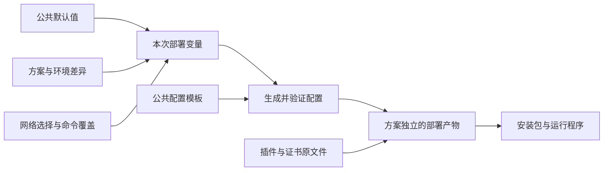

# 部署配置复用机制设计草案

日期：2026-10-08。状态：部署复用机制仍在设计；Core 全局指令注册、指令选项和两组回调已实现，Variables 留待讨论。

本文以本机 hosting、tools 及 Framework 源码为依据。用户已确认在部署阶段生成完整配置；安装和应用启动直接消费生成结果。若未来需要现场安装或启动时再填写配置，应另行定义交付契约，不混入本方案的第一阶段。

文中 `--variables`、`render:`、`--strict` 均为拟新增功能，示例不能直接交给当前版本执行。示例中的地址和密码均为虚构数据。

公共目录使用 `.shared`，按同层文件组织。Core 的通用指令选项和两组回调已确定并实现；变量来源、变量抽象和参数化导入的最终 API 尚未确定，其余部署复用能力仍为提案。

## 1. 现有机制与实际边界

### 1.1 部署调用链

当前各宿主的 `deploy.cmd` 依次执行 Cake 构建、`dotnet deploy`，最后可选执行 `dotnet-pack`。脚本将 scheme、environment、debug、host、site、编译配置、平台和架构传给部署器。

部署器先加载变量，确定 destination，再解析所有部署清单、解析包依赖、验证部署计划，最后执行复制或删除。预检查失败不执行目标写入；执行中途失败停止后续操作，但不会回滚此前写入。

| 对象 | 当前作用 | 对本次设计的影响 |
| --- | --- | --- |
| `.deploy/<scheme>/` | 按脚本和清单中的路径约定选择配置、证书、插件等资产 | scheme 目前是普通变量；部署器没有独立的方案继承或方案加载器 |
| 宿主 `.deploy` | 声明文件、插件、配置和目标位置 | 可继续承担资产装配职责 |
| 根 `.env` | 提供工具共享变量 | 已有合并与递归求值基础，不必另造变量语言 |
| `#@import` | 由 Core Profile 合并 INI 内容 | 能组合公共变量，但路径不支持变量展开和通配符 |
| `.option` | XML 配置，部署时原样复制 | 目前缺少配置内容生成能力 |
| `overwrite:newest` | 比较源和目标文件的修改时间 | 不能据此判断变量变化后是否应更新生成文件 |
| `dry-run/report/lockFile/previous/prune` | 预演、报告、锁定和有所有权依据的清理 | 新生成操作必须进入同一部署计划 |

daemon、terminal 将插件部署到编译输出目录；Web 未指定 destination，默认写入宿主目录。三者的目标位置都没有按 scheme 隔离。因此现有 scheme 主要隔离输入资产，并不同时隔离输出产物。

### 1.2 当前变量加载与求值

deployer 的实际顺序为：

```text
进程环境变量
  → 文件系统根目录至当前工作目录的各级 .env
  → destination 下的 appsettings.json
  → 本次命令选项
```

后者覆盖前者，名称忽略大小写，空值也覆盖。每级仅查找直属 `.env`，不会搜索 `.deploy/<scheme>/`，也不会随插件清单切换变量作用域。

`.env` 使用 Core Profile 的 INI 语法，并非 Bash 脚本或通用 dotenv 语法。例如 `[io rustfs]` 下的 `access_key` 变成 `io_rustfs_access_key`。不要假设支持 shell 的引号、export 或转义规则。

`$(name)`、`%name%` 按需递归展开；缺失、循环及超过 64 层均失败。合并完成后才求值，所以公共变量可以引用随后被方案覆盖的值。当前不支持动态变量名，例如 `$(redis_$(network)_host)`。

destination 有单独的预解析：先用环境、`.env` 和完整命令选项定位，再加载目标 `appsettings.json`。这使旧目标目录里的配置也能影响本次部署的变量，新增配置生成能力时不应继续扩大这种反馈关系。

### 1.3 内容复用与文件复用是两件事

当前默认路径解析器只登记 Copy；没有把 Normalizer 用于被复制文件的内容。给 `.option` 写入 `$(redis_host)`，当前部署器会原样复制这段文字。

现有 `#@import` 可以合并 `.deploy` 清单或 INI 变量，却不是 XML 的导入或合并语法。导入条目的相对路径以实际声明文件为基准，不会因为从某个 scheme 文件导入，就自动改为该 scheme 目录。

插件运行时会加载同主名的基础 `.option`、当前环境 `.option`、环境后缀文件及 host/site 文件。因此 `-debug.option` 是否被部署，以及旧文件是否残留，会影响最终运行配置；运行时并不是根据本次 deploy 命令的 debug 参数决定是否忽略这些旧文件。

### 1.4 样例核对

Zongsoft 默认方案当前主要包含 Aliyun 配置、Web 配置及升迁定义。另检查了 Automao 的部署资产作为实际复杂样例：其六份 `app.development/test/production[-debug].option` 均有 14 个元素、22 个属性，元素与属性名称序列一致。这证明至少这一组配置非常适合抽出公共结构，并把环境和网络差异移到变量层。

这项检查仅比较结构，不表示所有插件配置都结构相同，也没有连接这些配置所指向的服务。

## 2. 推荐方案及选择理由

推荐组合：**公共配置模板 + 显式选择的分层变量 + 原样部署的方案资产**。



| 方案 | 优点 | 主要问题 | 选择 |
| --- | --- | --- | --- |
| 各 scheme 保存完整配置 | 直观 | 同一结构多处维护，环境和网络维度继续放大重复 | 保留给确有独立结构的少数文件 |
| 公共 XML 加差异 XML 自动合并 | 差异看起来较小 | 集合按什么键合并、如何删除、顺序如何处理，都需要额外语义；换 JSON 又是一套规则 | 首期不做通用结构合并 |
| 公共模板加分层变量 | 与当前差异主要集中在值的情况吻合；输出仍是标准配置 | 必须处理格式转义、输入追踪和内容更新 | 推荐 |
| 启动时读取 scheme 和变量文件 | 同一产物可在多环境使用 | 改变运行和交付契约，运行现场还需模板与参数 | 有明确现场注入需求时单独设计 |

复用 `.env` 的解析、覆盖和求值机制，但不把所有配置格式都改成 `.env`。XML 保留表达配置结构；INI 表达差异值；`.deploy` 表达部署位置。

## 3. 目录布局与组合方式

保持 `.deploy/<scheme>`，公共资产区采用用户指定的 `.shared` 名称。公共文件可以直接放在同一层；工具不根据子目录推断产品、环境或优先级，组合关系由方案 `.env` 中的导入语句明确表达。

```text
hosting/
	.env
	.deploy/
		.shared/
			defaults.env
			aliyun.env
			aws.env
			erp.env
			production.env
			erp-production.env
			network-private.env
			network-public.env
			app.option.template
			Zongsoft.Externals.Aliyun.option.template
			app.deploy
		aliyun/
			.env
			certificates/
			daemon.deploy
		aws/
			.env
			certificates/
			daemon.deploy
```

部署方案可以继续叫 `aliyun`、`aws`，也可以叫 `customer-a`。scheme 表达完整的部署目标，不要求它只能代表云厂商。客户、产品、云厂商之间的公共值通过显式导入组合，避免引入多继承搜索规则。

用户提出的方案 `.env` 可以写为：

```ini
#@import ../.shared/$(product).env
#@import ../.shared/$(environment).env
#@import ../.shared/$(product)-$(environment).env

[mysql]
database=zongsoft
username=program
password=example-password

[redis]
server=10.20.0.11
password=example-password
```

### 3.1 可行性结论

该组织方式可行。扁平目录无需工具扩展；参数化导入需要变量求值能力。当前 Core 提供 `Directives.Processing`，调用者可在具体指令解释参数前改写 `Argument`，也可设置 `Handled` 接管指令。`Loading/Loaded` 负责根文件及导入文件的读取通知。

Core 继续负责 INI 读取、相对路径、导入合并、来源及循环检测。Variables 本轮不实现，变量的独立抽象、来源和求值顺序留待后续讨论；不能将下文变量示例视为现有内置功能。

### 3.2 用户示例的加载与覆盖

假设导入时 `product=erp`、`environment=production`，三行依次加载：

```text
.shared/erp.env
.shared/production.env
.shared/erp-production.env
随后读取方案 .env 中的 mysql、redis 等声明
```

若四处依次将 `mysql_database` 设为 `erp`、`production`、`erp_production`、`zongsoft`，最终文件合并值是 `zongsoft`；若还有显式命令选项覆盖该键，最终采用显式选项值。

这继承按读取顺序覆盖的语义，不增加“所有本地声明始终优先”的特殊规则。本地声明放在导入前面，仍可能被后面的导入覆盖。用户示例将方案值放在导入之后，恰好表达方案覆盖公共值。

`.shared/production.env` 应只放所有产品共有的生产环境值；特定产品的生产差异放入 `erp-production.env`。无需为没有共享内容的层强行填入业务配置。

### 3.3 导入路径与普通值的求值时机

**导入路径必须在读到该语句时求值；普通配置值仍可在合并完成后求值。** 先知道文件名才能打开文件，因此不能用“所有文件读完后的最终变量”反过来决定要读哪些文件。

此前提到的“路径变量是否允许来自本文件此前的声明”，与选用 Variables 还是回调是两个独立问题，尚未确认，不阻塞本轮对实现方式的评估。例如以下写法需要另外定义本文件条目加入路径变量的规则：

```ini
product=erp
#@import ../.shared/$(product).env
```

这种扩展可以让方案直接关联产品，不必每次运行都另外输入产品。但仅新增 ProfileOptions.Variables 并不自动具备这种能力；必须明确本地条目何时、如何进入变量上下文。无论最终怎样选择，若调用者显式指定 `--product:crm`，都不应发生“导入 erp.env、最后变量却显示 crm”的不一致。

若允许本地先声明，路径求值应使用本次读取位置可见的变量，加上最高优先级的显式参数；尚未读到的声明不可用。下例在外部也没有 product 时，应立即报告未定义变量：

```ini
#@import ../.shared/$(product).env
product=erp
```

来自已完成导入的声明能否继续用于后续导入，以及后续重定义已用于选文件的变量应如何诊断，将按这一选择进一步定稿；不能把原提案中冻结全部控制参数的规则直接套用于 product。

### 3.4 需要明确的边界

- **缺失变量与缺失文件不同。** `product` 未定义或用于选择产品的值为空，应报错，不能展开为空后继续寻找 `.env`。已解析得到 `erp-production.env` 但文件不存在，则属于组合覆盖层是否可选的问题；此项暂不决定，也不将上一轮全严格导入建议视为已确认。
- **保持相对来源。** 方案 `.env` 中的 `../.shared` 相对于该方案文件；被导入文件自己的相对导入仍相对于它自己，不相对于命令工作目录或最外层方案。
- **先识别路径项，再展开。** 变量结果作为单个路径，不再按空格或竖线重新拆分，避免展开结果改变导入文件数量。包含空格的字面路径应如何声明属于路径语法的后续细节。
- **在展开后的实际路径上检测循环。** `a.env → $(next).env → a.env` 必须被识别，保留深度上限、原始表达式和实际导入链。
- **名称处于同一空间。** 用户示例适用于产品名、环境名没有冲突的情况。若将来两类名称相同，可改用同层的 `product-$(product).env`、`environment-$(environment).env`；不必恢复目录层级。暂不强制命名前缀。
- **导入原文不改写。** 保留 `#@import ../.shared/$(product).env` 作为原始声明，解析得到的实际路径用于来源追踪和读取；不把绝对路径或变量展开结果写回源文件。

对普通值的递归求值、动态导入链的循环检测分别处理。例如公共文件里 `connection=$(mysql_server)` 可以在方案最终覆盖 mysql_server 后再展开，但用于选择导入文件的变量不能等待未来文件提供。

如采用这种组合方式，常用入口可简化为仅指定所选方案的 `.env`，产品与环境公共层由该文件导入。下文多文件 `--variables` 示例保留为上一轮提案，不代表必须继续由脚本拼接这些层。

### 3.5 Core 已确定的扩展机制与变量待议项

Core 的读取选项分成两组回调：

- `Loading/Loaded`：针对根文件及每个实际打开的导入文件；前者在打开及递归检查之后、解析之前通知，后者在解析与合并完成后通知。根文件没有 `Referer`。
- `Directives.Processing/Directives.Processed`：针对每条被处理的指令；前者允许改写 `Argument` 或通过 `Handled` 接管，后者在成功完成后通知。

`ProfileDirectiveContext.Argument` 是指令名后由空格或 Tab 分隔、去除两端空白后的整段文本；含义由具体指令解释。导入指令使用空格、Tab 或竖线拆分路径，其他指令可定义自己的参数语法。回调改写只影响本次执行，保存时保留原始指令注释。

各指令配置放入只读属性 `ProfileOptions.Directives` 所指向的可变集合，以名称忽略大小写索引。例如：

```csharp
var options = new ProfileOptions
{
	Directives = { ProfileDirectiveOptions.Import(ProfileDirectiveBehavior.Strict) },
};
```

通用行为为 `None`、`Strict`、`Ignore`、`Suppress`。`None` 使用具体指令内置行为；导入默认允许缺失文件。导入选项的 `MaximumDepth=0` 使用默认 64，正数指定上限，负数拒绝；根文件计一层。`Ignore/Suppress` 在指令回调之前生效，分别跳过和拒绝。未知指令在默认行为下可由回调处理，否则保留为注释；严格行为要求回调处理它。

读取顺序为：

```text
识别指令名称和 Argument
  → 应用该指令的行为设置
  → Directives.Processing，可改写参数或接管
  → 具体指令解释参数（导入在此拆分路径）
  → 导入按声明文件解析相对路径，打开文件并校验深度及循环
  → Loading
  → 读取、递归处理指令并合并
  → Loaded
  → Directives.Processed
```

**Variables 暂不加入 Core。** 后续需要确定通用变量求值器是否独立、Profile 如何接入，以及工具提供变量与文件内已有声明如何合并。两组回调提供了扩展位置，但并未自动定义变量来源或优先级。

若由工具在 `Directives.Processing` 中替换整个导入参数，替换结果仍由导入指令拆分：变量值中的空格或竖线可能改变路径数量。因此第 3.4 节“先拆分路径项再展开”的提案还需配套确定导入参数语法与求值入口，不能声称现有通用回调已满足该规则。普通条目值是否延迟到合并完成后求值也留待变量方案统一定义。

指令实现通过 Profile.Directives 在进程内统一注册，默认 ImportDirective；每次根加载固定注册表快照，递归导入共享本次快照与读取状态。ProfileOptions.Directives 只管理本次行为和回调，Options 指回所属 ProfileOptions。ProfileDirectiveContext 继承 ProfileContext，Referer 表示当前声明配置的直接引用者。Variables 仍待设计。

## 4. 新增显式变量输入

#指令实现通过 Profile.Directives 在进程内统一注册，默认 ImportDirective；每次根加载固定注册表快照，递归导入共享本次快照与读取状态。ProfileOptions.Directives 只管理本次行为和回调，Options 指回所属 ProfileOptions。ProfileDirectiveContext 继承 ProfileContext，Referer 表示当前声明配置的直接引用者。Variables 仍待设计。

## 4.1 命令契约

新增通用选项 `--variables`，接收按顺序排列的文件路径，以分号分隔，整个值需要加引号。不采用重复的同名命令选项，因为当前入口会将选项收集为字典，重复选项无法自然保留顺序。

从 hosting 根目录调用的拟议示例：

```powershell
dotnet deploy --scheme:aliyun --environment:production --network:private --variables:'.deploy/$(scheme)/.env;.deploy/$(scheme)/$(environment).env;.deploy/.shared/network-$(network).env' --destination:'.artifacts/example' daemon/.deploy
```

这里演示变量选择，完整清单和独立输出见后文。CMD 中采用双引号包裹 `--variables` 的值；脚本继续负责收集用户选项，实际文件解析由 .NET 工具完成。

具体规则：

1. 不指定 `--variables` 时，不额外加载文件。
2. 列表顺序就是覆盖顺序；不按目录名或文件名重新排序。
3. 显式列出的文件必须存在；其递归导入使用 `ProfileDirectiveBehavior.Strict`，避免拼错方案或公共文件后悄悄用默认值继续部署。
4. 不支持列表项通配符，也不支持路径内的分号。需要可选模块时，通过调用侧或明确条件选中整组输入，不把不存在一律当作可选。
5. 列表路径用部署选择参数展开；相对路径以当前工具约定的基准为准。deployer 是调用工作目录；具有 `--source` 的工具遵循最终 source。导入路径仍以声明它的文件为基准。
6. 同一命令的全部清单、插件和模板共享同一份已合并的变量。包内 `.env` 不自动加载，也不能覆盖本次方案。
7. 文件中的段落按现有规则以下划线展平。同一输入层中 `[redis] host` 与根键 `redis_host` 之类的展平重名应报错；跨层重名是有意覆盖。

#指令实现通过 Profile.Directives 在进程内统一注册，默认 ImportDirective；每次根加载固定注册表快照，递归导入共享本次快照与读取状态。ProfileOptions.Directives 只管理本次行为和回调，Options 指回所属 ProfileOptions。ProfileDirectiveContext 继承 ProfileContext，Referer 表示当前声明配置的直接引用者。Variables 仍待设计。

## 4.2 变量优先级

新设计建议为：

```text
工具默认值
  → 进程环境变量
  → 从根到调用基准目录的 .env
  → --variables 指定文件及其导入（按顺序）
  → 显式命令选项
```

保留现有 `.env` 可以覆盖进程环境的约定。CI 如果要覆盖最终方案值，应显式传入命令选项，或将其专用变量文件放到输入列表末尾，不能假设普通进程环境具有最高优先级。

**取消将 destination/appsettings.json 自动展平为通用部署变量。** 输出目录可能来自上次部署；让它参与生成下一份配置会使干净目录与旧目录得到不同结果。原有 `application` 等需求改为显式参数或受控变量文件声明。这里是有意的行为变更，不为兼容保留隐藏回读。

构建配置参数 edition 与安装包身份 Edition 当前是不同命令里的不同概念；本次不将二者合并。以后整理参数名称可以独立处理。

#指令实现通过 Profile.Directives 在进程内统一注册，默认 ImportDirective；每次根加载固定注册表快照，递归导入共享本次快照与读取状态。ProfileOptions.Directives 只管理本次行为和回调，Options 指回所属 ProfileOptions。ProfileDirectiveContext 继承 ProfileContext，Referer 表示当前声明配置的直接引用者。Variables 仍待设计。

## 4.3 先选输入，再求值

加载过程分成两个阶段：

1. 用默认值、进程环境、祖先 `.env` 和显式选项确定并冻结 scheme、environment、host、site、network、framework、edition、platform、architecture、destination 和变量文件列表。
2. 加载所选变量文件，合并普通业务配置值，再按需递归求值并生成配置。

显式变量文件不得重新定义第一阶段的控制参数；它们可在普通值里引用这些参数。否则就会出现“读 production.env 后把 environment 改为 test，但输入已经选过”的悖论。也不允许某个变量文件改变后续文件列表本身。

同次执行记录有效来源和被覆盖来源，保留文件、行号和导入链。缺失变量的错误应指向模板位置，并给出已经加载的变量文件；循环则显示引用链。

## 5. 环境与内外网差异示例

建议将网络访问方式独立为 `network=private/public`。现在 debug 同时影响编译配置、默认平台和配置文件选择；它不适合长期兼任网络拓扑开关。Debug 编译也可以连内网，Release 编译也可能从公网访问服务。

公共默认值：

```ini
[mysql]
port=3306

[redis]
port=6379
```

aliyun 方案 `.env` 声明基础端点和认证值，`production.env` 覆盖生产数据库、桶名称或生产专用地址。AWS 方案只提供自己不同的值，不复制整份 XML。

公共 `.shared/network-private.env`：

```ini
[mysql]
host=$(mysql_private_host)

[redis]
host=$(redis_private_host)

[aliyun]
intranet=true
```

公共 `.shared/network-public.env`：

```ini
[mysql]
host=$(mysql_public_host)

[redis]
host=$(redis_public_host)

[aliyun]
intranet=false
```

这种方式利用已有的递归引用能力，没有增加条件表达式或动态变量名。模板只引用 `redis_host`；network 层负责决定它指向哪种端点。各服务的私网、公网端点分别声明，不假设 MySQL、Redis、RustFS 共用同一个 IP。

同理可以声明 `server_private_host`、`server_public_host`，以及面向浏览器的 `site_public_url`。对外 URL 不应因为应用内部改用私网连接而被替换成内网地址。

公共默认值宜放端口、超时等真正共有的值。客户身份、密码、证书和生产端点属于具体方案或其显式引用的私有输入；缺失选中方案不能回退到 default 方案。

## 6. 配置生成及格式规则

### 6.1 显式生成条目

新增 `render:` 解析器；现有 `path:` 和省略前缀的条目继续复制原始字节。

例如 `.deploy/.shared/app.deploy` 中：

```ini
render:app.option.template = $(option_file)

[plugins zongsoft externals aliyun]
render:Zongsoft.Externals.Aliyun.option.template = Zongsoft.Externals.Aliyun.option <cloud:aliyun>
```

`option_file` 由宿主调用显式提供：daemon 为 `Zongsoft.Hosting.Daemon.option`，terminal 为 `Zongsoft.Hosting.Terminal.option`，Web 为 `web.option`。变量文件可声明 `cloud=aliyun`，但 cloud 不参与第一阶段的输入路径选择。

`render:` 首期要求单个文本源及明确目标文件，不递归渲染目录，不把二进制或所有 `.option` 自动当模板。模板可约定使用 `.template` 后缀；解析器根据去掉该后缀后的格式选择生成器。

模板示例：

```xml
<?xml version="1.0" encoding="utf-8"?>
<configuration>
	<option path="/Externals/Redis">
		<connectionSettings default="main">
			<connectionSetting connectionSetting.name="main" driver="redis" value="server=$(redis_host):$(redis_port);password=$(redis_password)" />
		</connectionSettings>
	</option>
</configuration>
```

aliyun 生成的值可以是 `server=10.20.0.11:6379;password=example-password`；aws 可以是自己的端点。同一个配置结构不再分别保存在每个 scheme、environment 和 debug 文件里。

### 6.2 首期支持范围

首期优先实现 XML（`.option`、`.xml`）生成器，因为已核对的重复配置主要属于这一类。先解析 XML，再对属性值和文本值求值，由 XML writer 完成转义；不对标签名、属性名和注释做替换，不允许变量注入任意 XML 片段。

例如密码是 `a&b"c`，写入属性必须产生正确的实体编码，XML 读取后还原为同一字符串。简单对整个文件做 Replace 无法保证这一点。

保持注释、元素顺序和属性顺序。`.option` 的 `connectionSetting.name` 等具名项属性有实际解析语义，不能为了格式化重新排序属性。验证应同时覆盖 XML 可解析性和 Core 配置键值，不仅检查字符串中是否还存在占位符。

输出统一采用 UTF-8；XML 声明与实际编码一致，普通文本使用 CRLF。未来支持 shell 模板时单独指定 LF。证书和原样复制的文件保持字节不变。

未知格式明确报错。JSON 若后续加入，必须在语法树中替换字符串值，并为数字、布尔、null 单独定义类型转换契约；不能把 XML 转义器或裸文本替换器直接套过去。INI/Web profile/升迁参数已由各工具按自己的语义读取，优先复用它们的变量入口，不重复引入另一层全文件渲染。

### 6.3 两层语法不能混淆

XML 正确转义不等于数据库连接字符串正确。例如密码包含分号时，还涉及连接字符串自身的引号和分隔规则。第一版不声称提供所有驱动的连接字符串拼装器：这类值可由方案提供已按驱动规则构造好的完整 `mysql_connection`，模板仅引用它；或者在确认驱动支持独立字段后按其真实配置模型拆分字段。

任何未来新增的连接字符串构造辅助器都应按实际驱动语法实现并验证，不能自创通用反斜杠转义。端口、必填认证值和外部服务可连接性也不是 XML 语法校验能够证明的。

### 6.4 变量字面量与求值次数

渲染使用现有 `$(name)` 语法，并开启共享求值器已有的字面量转义能力：`$$(name)` 输出字面 `$(name)`；`%%name%%` 输出字面 `%name%`。该能力目前尚未由 deployer Normalizer 开启，需要作为新行为明确接入。

变量只按依赖关系递归求值；渲染完成后的文本不再次扫描，避免把输出中的字面量当成新变量。纯空白值需要由内容生成入口保留，不能直接套用当前 Normalize 对全空白返回空字符串的规则。空值、未定义值和有意留白分别处理。

模板只做取值和受控格式转换，不执行 shell、C# 或任意表达式。结构分支由部署清单的既有过滤条件选择模板或插件组合。

## 7. 证书、插件与真正的结构差异

证书文件仍从选中 scheme 的目录原样复制；模板仅引用部署后的证书路径、逻辑名称及相关配置值。路径要区分制作机源路径和运行时路径，不能把 `D:/...` 自动写成 Linux 运行路径。

拟新增 `--strict:true`：所有被选中的清单、普通源、证书和模板必须存在；选中的通配源匹配为空也失败。未被过滤条件选中的条目不要求存在。变量文件与 render 源始终严格，不依赖该开关。

hosting 的新流程启用严格模式，并整理清单里的占位引用。确实没有使用的插件或证书应不选中该条目，避免当前“缺失只警告、继续生成安装包”的行为掩盖遗漏。

RustFS 与 AWS S3 若使用同一个应用配置模型，仅切换端点和认证值即可；若使用不同插件、驱动或配置结构，则通过清单选择不同模块模板。不要把每个客户端都塞进一个充满条件的大模板，也不要为了统一形式自动合并任意 XML 集合。

## 8. 更新策略、冲突与旧配置

### 8.1 生成文件按内容更新

Render 操作先生成最终字节，再与目标内容比较。内容相同则不重写；不同则更新，不能使用模板时间与目标时间比较。

全局 `overwrite:newest` 继续作用于普通 Copy。生成操作采用独立且明确的内容规则：`newest` 和 `alway` 均不能跳过内容变化；全局 `never` 下若已有目标不同则报冲突，而不是带着旧配置报告成功。新脚本应在独立暂存目录生成，以减少已有目标的歧义。

所有模板先完成求值和格式验证，再开始目标写入。单个生成文件使用同目录临时文件加替换；不宣称整个部署目录具备事务回滚。

### 8.2 一个目标有一个最终生成者

允许插件包先提供默认配置，再由清单末尾的一个 Render 生成最终版本。后续普通 Copy 不得覆盖已声明的最终 Render；多个选中 Render 指向同一目标时直接报冲突。诊断列出双方清单及行号。

不要使用“模板文件也有优先目录、变量文件又有优先目录”的双重隐式继承。变量层可以覆盖值；结构选择必须在清单里看见。

### 8.3 消除残留后缀配置

若本次生成一个完整 `Feature.option`，载荷中就不能再无意保留上次的 `Feature.production-debug.option`。否则后者可能在运行时覆盖刚生成的内容。

优先使用全新的独立暂存目录组装每次载荷，且只选择本次所需配置。确有基础配置加环境覆盖的设计也可以保留，但清单必须明确列出这一组文件，不能依赖历史残留。

原地部署若保留，则依靠成功报告中的文件所有权清理。扩展 previous/prune 时将 Render 纳入所有权，且内容相同、由上次成功部署拥有的未重写文件应延续所有权。未知或已被手工修改的旧配置应报告冲突，由调用者处理，不进行无依据的批量删除。

## 9. 输出隔离与交付链

建议构建输出继续用于存放代码，部署阶段另行组装：

```text
.artifacts/<scheme>/<environment>/<host>/<site>/<network>/<edition>/<framework>/<platform>-<architecture>/
```

例如阿里云和 AWS 的文件位于不同根目录。这个布局解决的是输出隔离；同一目标再次制作时还应使用新的暂存目录，完成验证后才发布为可打包产物。

宿主编译输出作为基础输入，不能将上次已部署过插件的脏 bin 目录直接当作干净基线。脚本需要从干净发布输出或明确的宿主文件集合开始，随后装配插件、配置和证书。

Web 当前把 plugins、wwwroot、mime 和宿主输出分散作为打包输入，改造时必须全部指向同次组装结果；仅给 Web 增加 destination 而不调整 packager 输入会漏打或混打。

完整部署的拟议示例（从 hosting 根目录调用，省略 Cake 构建）：

```powershell
dotnet deploy `
	--scheme:aliyun --environment:production --network:private `
	--host:daemon --site:daemon --option_file:Zongsoft.Hosting.Daemon.option `
	--edition:Release --framework:net10.0 --platform:linux --architecture:x64 `
	--variables:'.deploy/$(scheme)/.env;.deploy/$(scheme)/$(environment).env;.deploy/.shared/network-$(network).env' `
	--destination:'.artifacts/$(scheme)/$(environment)/$(host)/$(site)/$(network)/$(edition)/$(framework)/$(platform)-$(architecture)' `
	--strict:true --report:'.artifacts/aliyun-production-daemon.json' `
	daemon/.deploy .deploy/.shared/app.deploy '.deploy/$(scheme)/daemon.deploy'
```

这是目标接口示例；现有宿主 `.deploy` 中的旧配置复制条目还需要迁移，不能与新模板条目直接叠加运行。

`dotnet-pack` 只打包本次生成结果，不重新求值应用 `.option`。独立 pack 命令应明确选择已经完成的产物及其方案身份，避免无提示地选取最近一次的 bin 内容。

但 packager 自身会生成 systemd、Nginx 等内容；migrator 也要读取数据库与存储参数。因此把显式变量文件加载能力放入 tools 的共享源码，并分别接入 deployer、packager、migrator，让它们可选用同一组输入。它们仍各自拥有制包、升迁和运行的职责，不能互相隐式调用。

后续接入 containerizer 时沿用这套变量加载契约，保留其服务模板、镜像计划和完整清单求值时机，不将应用配置生成器直接当作容器模板系统。

跨多个命令制作一个交付物时，要固定同一组输入身份和文件摘要；后续阶段发现变量输入已变化应失败并重建相关产物。不能只因为三个工具传了同样的文件名，就宣称它们使用了同一份内容。

方案隔离也应延伸到 `.packages` 和升迁输出的目录或身份校验。否则相同应用版本、RID 但不同客户的产物仍可能同名；不能仅凭文件名推断它们属于同一方案。

## 10. 与部署计划、预演和锁的整合

新增 Render 必须作为正式计划操作，不能在解析器内直接写目标文件。

计划增加模板输入、所用变量的来源及依赖关系、最终输出摘要、格式和渲染器规则版本。输入包含变量根文件及所有导入文件；保留普通复制和证书的源哈希。

现有 `.env` 初始化在部署会话之前完成，未进入 Plan.Manifests；现有锁主要核对清单、包和 Copy/Delete。扩展时需要让变量加载结果携带输入来源，移交给部署计划，而不是只给 Render 增加一个模板哈希。

`dry-run` 应完成变量合并、模板求值、格式验证、冲突检查和预期输出摘要计算，不写部署目标。显式 report 仍可输出；在线 NuGet 解析仍可能写缓存，不能宣称整个命令没有磁盘写入。

`locked` 应比较渲染输入及输出摘要。模板未改、变量值改了，也必须识别为计划变化。报告和锁无需新增完整变量值转储；记录变量名称、来源与所生成产物的摘要即可表达依赖。

尽量从本次读取的字节计算输入摘要并生成内容，避免“按路径另读一次摘要”的时间差。执行前检查输入变化；变量从本次冻结的进程和参数快照求值，不在写每个文件时重新读取环境。

当前执行器的 Kind 分支、锁的 Shape、报告状态和 previous/prune 均需认识 Render。只新增一个 resolver 而不更新这些分支，会导致锁定遗漏、错误地复制模板原文或无法清理生成文件。

## 11. 实现分工与落地顺序

| 位置 | 改动职责 |
| --- | --- |
| tools/.shared | 显式变量文件列表、加载来源、合并和求值上下文；复用 Profile 与 VariableEvaluator |
| deployer/Program.cs、Deployer.Command.cs | 参数解析、输入路径预解析、控制参数冻结、取消目标 appsettings 的隐式变量回读 |
| deployer 的新 Render resolver/renderer | XML 值求值、格式验证、字节生成；不执行目标写入 |
| DeploymentOperation/Plan/Session | Render 元数据、输入追踪、生成内容的会话持有 |
| Deployer.Execution.cs | 内容更新、冲突、预演、锁、报告与所有权规则 |
| packager、migrator | 显式变量入口及跨阶段输入身份核对；不重渲染应用配置 |
| hosting | 公共模板、差异变量、独立输出、脚本传参及打包输入调整 |
| Framework | 已实现通用指令选项与两组回调；变量能力待设计，配置验证复用 XML 配置读取器 |

建议按以下阶段推进：

1. 先完成显式变量输入和来源追踪，固定加载顺序、控制参数和严格导入契约。
2. 实现 XML Render 及计划整合，用两个人工方案验证相同模板产生不同端点配置。
3. 将一组宿主 app 配置迁移为模板，处理网络选择、残留配置和独立载荷目录。
4. 接入 packager/migrator 的共享输入，核对安装包与升迁产物的方案身份。
5. 在实际需要出现后扩展 JSON 或结构差异模块；不预先建设通用模板脚本语言。

阶段可以分开提交，但正式交付前必须闭合模板、变量、配置、证书、安装包和升迁参数的同方案链路。

## 12. 验收用例

验证应使用隔离源和目标目录，不运行真实部署、安装、容器或云服务操作。

| 场景 | 预期 |
| --- | --- |
| aliyun/aws 使用同一模板 | 公共结构一致，只有各自值不同 |
| 只修改变量、模板时间不变 | 生成结果更新 |
| 模板与变量均未变化 | 不重写目标，所有权仍可追踪 |
| 后层覆盖被公共值引用的变量 | 所有引用解析为最终值 |
| 未定义变量、循环、深度超限 | 写目标前失败，说明来源和引用链 |
| 显式方案/环境文件或导入缺失 | 失败，不回退其它方案 |
| 空字符串、纯空白、非 ASCII、XML 特殊字符 | 按契约保留并正确读回 |
| 密码含变量样式文字 | 转义后保留字面值，无二次展开 |
| 连接字符串含分号等字符 | 按具体驱动的合法表示验证，不用 XML 成功替代 |
| Render 重复目标或后续 Copy 覆盖 | 冲突失败并列出来源 |
| debug/public 切回 private | 无旧后缀配置残留并覆盖本次输出 |
| 证书匹配为空或跨方案路径错误 | 严格失败；证书复制前后字节一致 |
| dry-run | 完成配置验证，不写部署目标 |
| 仅变量变化后 locked | 拒绝变化，重新生成锁须显式进行 |
| previous/prune 遇到用户修改 | 保留并报告，不无依据删除 |
| Windows/Linux 路径及不同工作目录 | 遵循各工具基准和声明文件来源 |
| 变量文件在 deploy 与 pack/migrate 之间变化 | 拒绝混合不同输入制作交付物 |

代码阶段运行受影响工具的多目标框架测试、严格构建及 IDE0049 检查；使用 Core 配置读取器验证生成的真实键值。当前仅完成静态研究，没有执行以上未来功能的测试。

## 13. 本轮发现的现状问题

1. 三份 `deploy.cmd` 的环境输入写入 `value`，未赋回 `environment`。这会使交互选择与实际参数不一致；需要在实施时修复，研究阶段未改脚本。
2. tools/deployer 的部分文档写成 Cake 从进程变量 framework 读取。当前 hosting 调用未传 `--framework`，build.cake 使用 `Argument("framework", "net10.0")`；设计应以该实际入口为准，并显式保证构建、部署和打包框架一致。
3. Core 通过 ProfileOptions.Directives 为具体指令配置 None、Strict、Ignore、Suppress 行为。deployer 使用导入的默认行为，仅通过 Loading 登记导入文件哈希；默认允许缺失文件。
4. Automao 的公共 `.deploy/web.deploy`、`.deploy/daemon.deploy` 包含 `options/...` 相对引用，而方案资产位于 `.deploy/default/options`。按当前条目来源规则，这些引用不会自动改指 default 目录。该仓库仅作为研究样例，实施迁移前应单独核对并修正清单，不在本轮修改。

deployer 双语说明和专项指南同步当前实现；本设计中的部署渲染及变量扩展仍未实现。

## 14. 源码证据入口

- [daemon/deploy.cmd](../daemon/deploy.cmd)、[Web deploy.cmd](../web/default/deploy.cmd)、[terminal/deploy.cmd](../terminal/deploy.cmd)：实际参数与部署/打包位置。
- [Deployer.Command.cs](../../tools/deployer/src/Deployer.Command.cs)：变量优先级、destination 预解析、目标 appsettings 回读。
- [共享 Utility](../../tools/.shared/Utility.cs)：祖先 `.env` 读取和 INI 展平。
- [VariableEvaluator](../../tools/.shared/VariableEvaluator.cs)：递归求值、循环、深度及可选字面量转义。
- [DeploymentEntry](../../tools/deployer/src/DeploymentEntry.cs)：源路径以条目实际声明文件为基准。
- [DeploymentResolverManager](../../tools/deployer/src/DeploymentResolverManager.cs)、[DeploymentResolverBase](../../tools/deployer/src/DeploymentResolverBase.cs)：现有解析器与 Copy 操作。
- [Deployer.Execution.cs](../../tools/deployer/src/Deployer.Execution.cs)：计划、锁、覆盖、执行与清理。
- [EnvironmentVariablesTest](../../tools/deployer/test/EnvironmentVariablesTest.cs)：既有变量优先级和导入行为的测试。
- [Core ImportDirective](../../framework/Zongsoft.Core/src/Configuration/Profiles/ImportDirective.cs)、[Profile 说明](../../framework/Zongsoft.Core/docs/profiles.zh-Hans.md)：导入路径、严格加载和来源规则。
- [PluginConfigurationProvider](../../framework/Zongsoft.Plugins/src/Configuration/PluginConfigurationProvider.cs)：运行时配置文件选择。
- [XmlStreamConfigurationProvider](../../framework/Zongsoft.Core/src/Configuration/Xml/XmlStreamConfigurationProvider.cs)：XML 属性与实际配置键映射。

本轮没有运行 deploy.cmd、pack.cmd、构建、部署、安装或外部服务验证，也没有修改任何配置值、证书或宿主业务代码。
